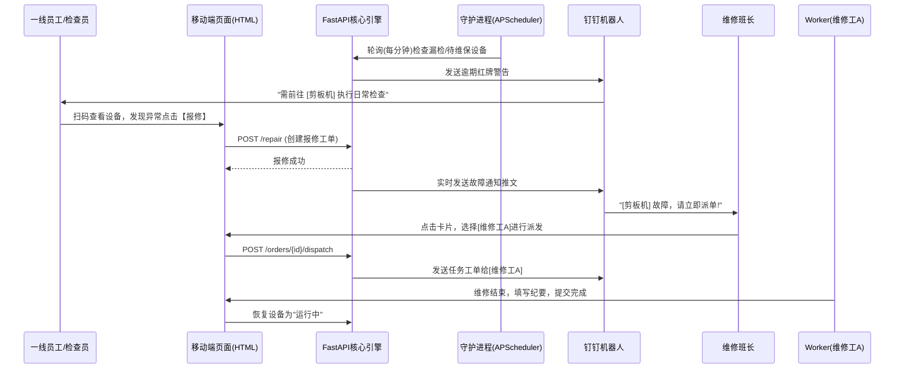

# 🏭 河北京车 - 设备管理系统 (Device Management System MVP)

本系统是专为装备制造业与企业内部设备管控设计的一套轻量化、高可用、闭环运转的设备全生命周期管理系统。涵盖了从设备台账建立、预防性维护（巡检与维保）、到故障扫码报修与工单流转的全业务流。

## 🛠 技术路线 (Technology Stack)

系统采用现代化的轻巧且高性能的技术栈构建，特别针对企业内网环境进行了离线化改造。

### 后端 (Backend)
- **核心框架**: [FastAPI](https://fastapi.tiangolo.com/) - 提供极高的并发性能与自动化的 API 文档 (Swagger)。
- **持久层**: [SQLAlchemy 2.0](https://www.sqlalchemy.org/) - 强大的 ORM 工具，管理关联数据源。
- **数据库**: **SQLite** - 以文件系统作为持久层，零配置，方便跨环境部署迁移。
- **定时任务**: **APScheduler** - 基于内存的后台调度器，负责双轨预防性任务的监控。
- **外部集成**: 钉钉 (DingTalk) OpenAPI - 接入企业内部应用机器人用于消息下发。

### 前端 (Frontend)
- **UI 基础**: HTML5 + Vanilla JS
- **样式引擎**: Tailwind CSS (离线版) - 提供高效可配的原子化样式。
- **视觉设计**: 深度采纳 **Glassmorphism (玻璃拟态)** 和高端内网暗黑高对比度模式。
- **图表与图标**: Chart.js (报表分析) + Lucide Icons (离线内联化矢量图标)。
- **核心特性**: 彻底剔除对外部公网 CDN 的依赖，支持内网/断网环境下的完全渲染 (Local Asset Mapping)。

---

## 🏗 功能组成 (System Features)

### 1. 📦 设备资产台账池 (Asset Hub)
- 设备的基础档案（名称、规格、入场日期、状态、负责人、部门）。
- 一键导出/导入 Excel，无缝衔接财务或老旧系统。
- 为每台设备自动生成唯一溯源二维码 (QR Code) 并保存于 `static/qrcodes/` 供打印。

### 2. 📅 预防性维护体系 (双轨制机制)
本系统最核心的亮点，巡检与维保彻底解耦，双轨运行：
- **检查计划 (Inspection Plan)**
  - 根据 **“设定天数 (Days)”** 为计算周期。
  - 绑定具体操作的检查项。
  - 到期后，每天在**指定时间 (如 08:30)** 精准推送给设备绑定的**巡检人**。
- **维护计划 (Maintenance Plan)**
  - 根据 **“自然月 (Months)”** 与 **“指定日期 (1-28号)”** 为核心锚点。
  - 无论大小月，到指定周期的指定号数并在设置的时间点，系统自动向**维修班长**推送月/季度级维保指令。

### 3. 📱 移动端作业流 (Mobile Workflow)
为车间一线员工提供极简的移动端界面（扫描设备二维码直接进入）：
- **快捷巡检 (`inspect.html`)**: 点选式完成检查单，异常立刻标红并触发告警。
- **极速报修 (`repair.html`)**: 车间员工发现设备停工，可一键搜索自己名字并填写描述，秒级推送到主管。

### 4. 🧰 工单闭环系统 (Work Order Process)
- 状态流转：`待处理` -> `维修中` -> `已完成`。
- 维修班长在钉钉点击推送卡片可直接进入调度中心 (`order.html`) 选择维修执行人进行派单。
- 维修完工后填写维修纪要，系统联动将设备状态恢复为“运行中”。

### 5. 📊 驾驶舱大屏与日志 (Dashboard & Logs)
- 大屏展示系统关键统计（设备宕机率、完好率、报修趋势图）。
- 留存精确到个体的《系统操作日志》，防篡改数据溯源。

---

## ⚙️ 模块交互流程 (Module Interactions)

---

## 🌟 系统亮点 (Highlights)

1. **绝对内网生存能力**: 经过代码重构，前端依赖库彻底本地化，杜绝了企业由于屏蔽外网造成的白屏、加载卡顿（如 `ERR_CONNECTION_CLOSED`）。登录模块拥有极客级的冷启动秒开体验。
2. **算法驱动的节流推送**: 在后端 APScheduler 中设计了智能的节流算法（23小时窗口防抖），既能保证分钟级的高精度时刻匹配触发，又杜绝了向用户发生定时炸弹式的消息轰炸。
3. **架构的高拓展性**: Python 配合 ORM 让未来二次开发变得异常容易。使用多版本迁移脚本 (`update_db_x.py`) 完成数据平滑过渡。
4. **低门槛与人机交互 (HCI)**: 对于一线工人的前端只聚焦于极简的操作选项，核心复杂的工单调度被优雅地折叠交还给了管理节点。

## 🚀 启动指引 (How to run)

1. 环境配置：安装 Python 3.10+。
2. 安装依赖：`pip install -r requirements.txt` (核心含 `fastapi`, `uvicorn`, `sqlalchemy`, `apscheduler` 等)。
3. 初始化静态库：确保 `static/js` 中包含基础依赖，如果无可用外网可通过执行 `python download_assets.py` 下载。
4. 启动服务：`uvicorn main:app --host 0.0.0.0 --port 8000` (或直接运行 `python main.py`)。
5. 访问项目：进入 `http://localhost:8000/`，默认管理员账号密码均为 `admin`。
