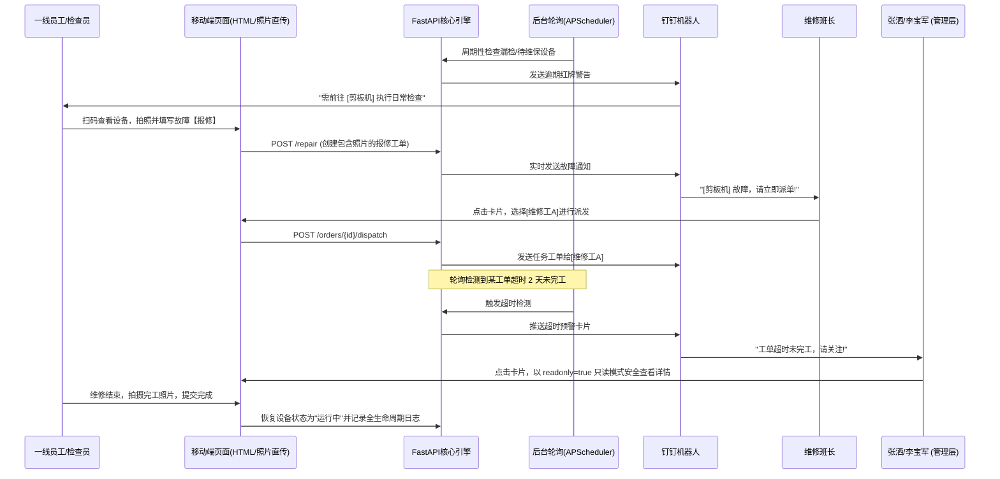

# 🏭 河北京车 - 设备管理系统 (Device Management System MVP)

本系统是专为装备制造业与企业内部设备管控设计的一套轻量化、高可用、闭环运转的设备全生命周期管理系统。涵盖了从设备台账建立、预防性维护（巡检与维保）、到故障扫码报修、多端照片上传与工单流转的全业务生命周期。

---

## 🛠 技术路线 (Technology Stack)

系统采用轻量、高性能的技术栈构建，特别针对企业内网/断网环境进行了深度改造，确保 100% 离线生存能力。

### 💻 后端 (Backend)
- **核心框架**: [FastAPI](https://fastapi.tiangolo.com/) - 异步高性能 Web 框架，提供极高的并发性能与自动化的 API 交互文档 (Swagger)。
- **持久层**: [SQLAlchemy 2.0](https://www.sqlalchemy.org/) - 强大的 ORM 工具，优化了 N+1 联表查询以防止高并发下的瓶颈。
- **数据库**: **SQLite** - 文件系统持久层，零配置，极度方便跨环境快速部署与整体迁移。
- **定时调度**: **APScheduler** - 基于内存的后台调度器，负责双轨预防性维保任务轮询与超时告警。
- **第三方集成**: 钉钉 (DingTalk) OpenAPI - 深度集成钉钉企业内部应用机器人，实现消息的精准多端下发。

### 🎨 前端 (Frontend)
- **UI 基础**: HTML5 + Vanilla JS
- **样式引擎**: Tailwind CSS (离线本地化版本) - 提供高效可配的原子化样式与高度定制化体验。
- **视觉设计**: 深度采纳 **Glassmorphism (玻璃拟态)** 和高端工业暗黑高对比度模式。
- **图表与图标**: Chart.js (全维度报表分析) + Lucide Icons (离线内联矢量图标库)。
- **网络优化**: 彻底剥离所有公网 CDN 依赖，完美应对企业局域网/隔离物理网络环境。

---

## 🏗 功能组成与核心机制 (System Features)

### 1. 📦 设备资产台账池 (Asset Hub)
- **全面管理**: 设备名称、序列号(SN)、固定资产编号、规格型号、厂家、入厂日期、终验通过日期、放置地点、使用年限、负责部门、责任人、维修班长等。
- **智能置顶**: **[新增]** 大屏端对状态为“故障”的设备进行最优先排列，首屏显著展示，确保高风险设备第一时间获得处理。
- **双向 Excel 交互**: 支持将全部设备台账批量导出为标准 `.xlsx` 格式，也支持一键导入，无缝对接原有企业财务/资产系统。
- **一键溯源**: 自动为每台新设备生成唯一的二维码 (QR Code)，保存在 `static/qrcodes/` 供打印张贴。

### 2. 📅 预防性维护体系 (双轨制机制)
巡检与维保彻底解耦，双轨并行，支持按小时精度智能节流防轰炸：
- **检查计划 (Inspection Plan)**
  - 基于 **“设定天数 (Days)”** 为计算周期。
  - 绑定具体操作的检查项。
  - 到期后，每天在**指定时间 (如 08:30)** 推送给设备绑定的**巡检人**。
- **维护计划 (Maintenance Plan)**
  - 基于 **“自然月 (Months)”** 与 **“指定日期 (1-28号)”** 为核心锚点。
  - 在指定周期的指定号数并在设置的时间点，系统自动向**维修班长**推送月/季度级维保指令。

### 3. 📱 移动端作业流 (Mobile Workflow)
为车间一线员工提供极简的移动端界面（扫描设备二维码直接进入）：
- **快捷巡检 (`inspect.html`)**: 点选式完成检查单，支持批量上传现场故障照片，异常立刻触发告警。
- **极速报修 (`repair.html`)**: 一线工人在发现设备停工后，可一键扫描选择设备、填写描述并拍摄现场故障照片，秒级推送到调度中心。

### 4. 🧰 工单闭环系统 (Work Order Process)
- **闭环状态**: `待处理` (故障申报) -> `维修中` (已派发) -> `已完成` (完工归档)。
- **智能派单**: 维修班长在钉钉点击推送卡片可直接进入调度中心 (`order.html`) 快捷搜索并选择维修执行人进行派单。
- **结果回填**: 维修工人在完工后填写维修纪要并上传完工证明照片，设备状态自动联动恢复为“运行中”。

### 5. 🔔 智能预警与安全查看机制
- **超时工单监控**: **[新增]** 后台任务每分钟轮询，若有工单提交超过 **2 天 (48 小时)** 仍未完工（处于 `待处理` 或 `维修中` 状态），自动触发报警。
- **多端钉钉下发**: **[新增]** 超时报警自动定向推送给企业高管或特定负责人（如 **张洒**、**李宝军**）。
- **安全只读模式**: **[新增]** 超时推送链接自带安全隔离标识（`?readonly=true`），特权负责人在通过此链接进入详情页面时自动限制操作权限，仅可查看工单详情，规避误操作风险。

### 6. 📊 驾驶舱大屏与全周期日志 (Dashboard & Logs)
- **数据可视化**: 宕机率、设备完好率、报修趋势折线图、人员工作负载分布。
- **日志分页**: **[新增]** 系统日志管理面板支持高性能的分页渲染（每页 15 条），大幅提升历史数据加载效率。
- **日志批量导出**: **[新增]** 提供全量系统日志一键导出为 Excel 文件的功能，方便进行数据审计和历史分析。

---

## 📸 多端现场照片直传机制 (Media Upload)

系统原生支持报修现场照、完工证明照的直传：
- 采用自带原生调用相机的 `capture="environment"` 属性，极大优化移动端操作体验。
- 通过 `/api/upload-photo` 接口实现图片异步上传并分类存放在 `static/photo/` 下。
- 数据库底层扩展了 `system_logs` 与 `work_orders` 对 JSON 照片路径列表的支持，并在详情页、日志列表实现优雅渲染。

---

## ⚙️ 核心模块交互流程 (Module Interactions)



---

## 🌟 系统技术亮点 (Technical Highlights)

1. **绝对离线/内网设计**: 前端所有资源（包括 CSS 库、JS 库、矢量图标）完成 100% 本联映射，彻底规避因企业内网隔离导致的 CDN 加载失败或白屏问题。
2. **高容错与数据一致性**: 设计完善的平滑过渡策略，通过版本化迁移脚本 (`update_db_v5.py` / `update_db_v6.py`) 对数据库（如添加照片字段、新增通知记录表）进行零损升级。
3. **算法节流推送**: 在 APScheduler 后台任务中，设计了基于计划类型与设备主键组合的 23 小时滑动窗口防抖节流算法，在保障高频率（分钟级）扫描的同时，彻底杜绝钉钉消息轰炸。
4. **极简人机交互**: 充分考量一线车间操作习惯，移动端支持无缝调用原生摄像头，操作路径控制在 2 步以内。

---

## 🚀 快速启动指引 (How to run)

### 1. 环境准备
确保您的物理机或服务器上已安装 Python 3.10+ 环境。

### 2. 依赖安装
```bash
pip install -r requirements.txt
```
> 核心依赖包含 `fastapi`, `uvicorn`, `sqlalchemy`, `apscheduler`, `pandas`, `openpyxl` 等。

### 3. 本地静态依赖下载
如果初次拉取代码且无本地静态 JS 库，在有外网的环境下执行以下命令：
```bash
python download_assets.py
```
它将自动为系统抓取并锁定所需的离线版 Tailwind CSS、Lucide Icons 和 Chart.js 等前端核心资产。

### 4. 启动应用
- **手动启动**:
  ```bash
  uvicorn main:app --host 0.0.0.0 --port 8000
  ```
- **快捷启动 (Windows)**:
  直接双击根目录下的 `start_server.bat` 脚本即可一键完成环境切换与服务拉起。

### 5. 系统访问
使用同一局域网的设备访问：`http://<您的IP>:8000/` 或本地回环 `http://localhost:8000/`。
默认管理员账号与密码均为：`admin`。
