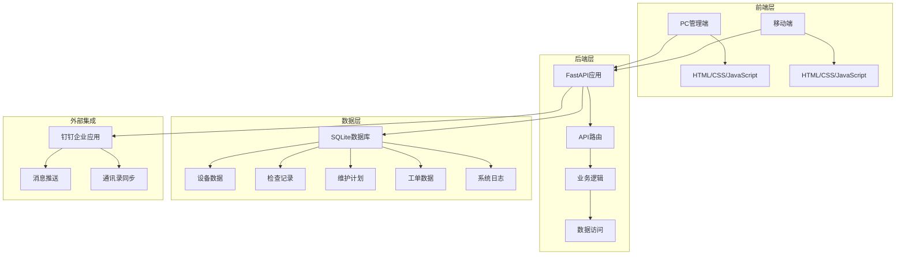

# 设备管理系统 MVP 技术文档

## 1. 项目背景与目标

### 1.1 项目背景
在现代工业生产环境中，设备管理是确保生产效率和安全的关键环节。传统的设备管理方式往往依赖人工记录、纸质文档和Excel表格，存在信息分散、难以追溯、维护不及时等问题。随着工业4.0和数字化转型的推进，企业对设备管理的信息化、智能化需求日益增长。

本项目旨在开发一套完整的设备管理系统，通过数字化手段实现设备全生命周期管理，包括设备信息管理、定期检查、维护计划、故障报修等功能，提高设备管理效率，降低运营成本，确保设备安全稳定运行。

### 1.2 项目目标
- **设备数字化管理**：实现设备信息的集中管理，包括基本信息、技术参数、维护历史等。
- **智能检查提醒**：基于预设的检查计划，自动提醒相关人员进行设备检查。
- **规范化维护流程**：建立标准化的设备维护计划和流程，确保设备得到及时维护。
- **故障快速响应**：通过工单系统实现故障报修、派单、维修和验收的全流程管理。
- **数据驱动决策**：通过数据分析和可视化，为设备管理决策提供支持。
- **移动化操作**：支持通过手机等移动设备进行设备检查和报修。

## 2. 技术架构设计

### 2.1 整体架构

本项目采用前后端分离的架构模式，后端使用FastAPI构建RESTful API，前端使用HTML、CSS和JavaScript实现用户界面。系统通过钉钉企业内部应用实现消息推送和通讯录同步，提高系统的实用性和便捷性。



### 2.2 技术栈选择

| 类别 | 技术/框架 | 版本 | 用途 |
|------|-----------|------|------|
| 后端 | FastAPI | 最新 | 构建高性能RESTful API |
| 数据库 | SQLite | 3.0+ | 轻量级数据存储 |
| ORM | SQLAlchemy | 2.0+ | 数据库对象关系映射 |
| 前端 | HTML5/CSS3/JavaScript | - | 用户界面实现 |
| CSS框架 | Tailwind CSS | 3.0+ | 响应式UI设计 |
| 图表库 | Chart.js | 4.0+ | 数据可视化 |
| 图标库 | Lucide | 最新 | 界面图标 |
| 任务调度 | APScheduler | 最新 | 定时任务管理 |
| 外部集成 | 钉钉开放平台 | - | 消息推送和通讯录同步 |
| 二维码 | qrcode | 最新 | 生成设备二维码 |

### 2.3 数据库设计

系统采用SQLite作为数据库，通过SQLAlchemy ORM进行数据操作。主要数据表包括：

1. **devices**：设备信息表，存储设备基本信息、技术参数、状态等。
2. **inspection_templates**：检查模板表，定义设备检查的标准和周期。
3. **maintenance_plans**：维护计划表，定义设备维护的项目和周期。
4. **inspection_records**：检查记录表，记录设备检查的结果和详情。
5. **work_orders**：维修工单表，记录设备故障报修和处理过程。
6. **users**：用户表，存储系统用户信息（同步自钉钉）。
7. **departments**：部门表，存储组织部门信息（同步自钉钉）。
8. **system_logs**：系统日志表，记录设备全生命周期的操作事件。

数据库表之间通过外键建立关联，确保数据的一致性和完整性。例如，设备与检查模板、维护计划之间通过多对多关系关联，设备与检查记录、工单之间通过一对多关系关联。

## 3. 核心功能模块详细说明

### 3.1 设备管理模块

**功能描述**：实现设备的全生命周期管理，包括设备信息的录入、编辑、查询和删除。

**实现逻辑**：
- 通过`Device`模型定义设备数据结构，包含基本信息、技术参数、状态等字段。
- 提供设备的CRUD操作API，支持单个设备的管理和批量导入。
- 为每个设备生成唯一的二维码，用于移动端快速访问。
- 支持通过Excel批量导入设备信息，自动匹配负责人和维修班长。

**关键算法**：
- 设备状态计算：根据检查记录和维修状态自动更新设备状态。
- 二维码生成：使用qrcode库为每个设备生成唯一的二维码。

**数据流程**：
1. 设备信息录入/导入 → 生成二维码 → 存储设备信息 → 绑定检查模板和维护计划 → 分配责任人。
2. 设备状态变更：检查/维修 → 状态更新 → 系统日志记录。

### 3.2 检查计划模块

**功能描述**：定义设备的定期检查标准和周期，自动提醒相关人员进行检查。

**实现逻辑**：
- 通过`InspectionTemplate`模型定义检查模板，包含检查项目、周期和提醒时间。
- 支持检查模板的创建、编辑、删除和分配。
- 设备可以绑定多个检查模板，实现不同类型的检查需求。

**关键算法**：
- 检查逾期计算：根据设备的最后检查时间和检查周期，计算设备是否需要检查。
- 提醒时间匹配：根据预设的提醒时间，在合适的时间点发送提醒。

**数据流程**：
1. 创建检查模板 → 绑定到设备 → 系统定期检查 → 发送提醒 → 执行检查 → 记录检查结果。

### 3.3 维护计划模块

**功能描述**：定义设备的定期维护项目和周期，确保设备得到及时维护。

**实现逻辑**：
- 通过`MaintenancePlan`模型定义维护计划，包含维护项目、周期和提醒时间。
- 支持维护计划的创建、编辑、删除和分配。
- 设备可以绑定多个维护计划，实现不同类型的维护需求。

**关键算法**：
- 维护到期计算：根据设备的最后维护时间和维护周期，计算设备是否需要维护。
- 提醒日期匹配：根据预设的提醒日期和时间，在合适的时间点发送提醒。

**数据流程**：
1. 创建维护计划 → 绑定到设备 → 系统定期检查 → 发送提醒 → 执行维护 → 更新维护时间。

### 3.4 检查执行模块

**功能描述**：通过移动端执行设备检查，记录检查结果和异常情况。

**实现逻辑**：
- 移动端通过扫描设备二维码访问检查页面。
- 根据设备绑定的检查模板，显示检查项目。
- 检查人员记录每个项目的状态（正常/异常）和备注。
- 提交检查结果后，系统更新设备状态和最后检查时间。

**关键算法**：
- 检查结果分析：根据检查项目的状态，自动判断设备是否存在异常。
- 状态更新：根据检查结果，自动更新设备状态。

**数据流程**：
1. 扫描二维码 → 加载检查项目 → 执行检查 → 提交结果 → 更新设备状态 → 记录检查历史。

### 3.5 报修工单模块

**功能描述**：实现设备故障的报修、派单、维修和验收全流程管理。

**实现逻辑**：
- 通过`WorkOrder`模型定义工单数据结构，包含故障描述、报修人、维修人等信息。
- 支持工单的创建、派单、完成和查询。
- 工单状态变更时，通过钉钉推送消息通知相关人员。

**关键算法**：
- 工单状态流转：从待处理 → 维修中 → 已完成的状态变更。
- 消息推送：根据工单状态和相关人员，发送不同类型的通知。

**数据流程**：
1. 发起报修 → 创建工单 → 通知维修班长 → 派单给维修人员 → 执行维修 → 完成工单 → 通知报修人。

### 3.6 系统日志模块

**功能描述**：记录设备全生命周期的操作事件，提供操作追溯和审计。

**实现逻辑**：
- 通过`SystemLog`模型记录系统操作事件，包含事件类型、操作人、内容等信息。
- 支持按设备、事件类型、时间等条件查询日志。
- 提供日志的分页和排序功能。

**关键算法**：
- 日志分类：根据操作类型对日志进行分类，如检查、报修、派单、完工等。
- 日志关联：将日志与设备关联，实现设备全生命周期的追踪。

**数据流程**：
1. 系统操作 → 生成日志 → 存储日志 → 查询和分析日志。

### 3.7 钉钉集成模块

**功能描述**：与钉钉企业内部应用集成，实现消息推送和通讯录同步。

**实现逻辑**：
- 通过钉钉开放平台API获取企业通讯录数据，同步到系统中。
- 根据设备检查和维护计划，通过钉钉机器人向相关人员发送提醒。
- 工单状态变更时，通过钉钉向相关人员发送通知。

**关键算法**：
- 通讯录同步：增量更新模式，确保系统人员数据与钉钉一致。
- 消息推送：根据不同场景和人员，发送个性化的通知内容。

**数据流程**：
1. 同步钉钉通讯录 → 系统人员数据更新 → 设备分配责任人 → 发送提醒和通知。

## 4. 项目亮点与创新点分析

### 4.1 技术选型优势

- **FastAPI框架**：采用现代化的FastAPI框架，提供自动API文档、类型提示和高性能异步处理，大大提高开发效率和系统性能。
- **SQLite数据库**：轻量级嵌入式数据库，无需额外配置，适合中小型应用，部署简单，维护成本低。
- **前后端分离**：采用前后端分离架构，前端使用HTML、CSS和JavaScript实现，后端提供RESTful API，提高系统的可维护性和扩展性。
- **钉钉集成**：与钉钉企业内部应用深度集成，实现消息推送和通讯录同步，提高系统的实用性和便捷性。

### 4.2 性能优化策略

- **数据库优化**：使用SQLAlchemy的joinedload加载关联数据，减少N+1查询问题，提高查询性能。
- **定时任务优化**：使用APScheduler进行定时任务管理，避免系统资源浪费，提高系统稳定性。
- **消息推送优化**：实现消息推送节流机制，避免重复发送通知，提高系统效率。
- **前端优化**：使用Tailwind CSS实现响应式UI设计，提高页面加载速度和用户体验。

### 4.3 用户体验创新

- **二维码扫描**：为每个设备生成唯一的二维码，通过扫描二维码快速访问设备信息和检查页面，提高操作便捷性。
- **移动化操作**：支持通过手机等移动设备进行设备检查和报修，实现随时随地的设备管理。
- **数据可视化**：通过Chart.js实现数据可视化，直观展示设备状态和检查趋势，帮助用户做出决策。
- **智能提醒**：基于预设的检查和维护计划，自动提醒相关人员进行操作，避免漏检和维护不及时的问题。
- **全流程跟踪**：实现设备从检查、报修到派单、完工的全流程管理和跟踪，提高管理透明度和效率。

## 5. 使用指南

### 5.1 环境配置

**系统要求**：
- Python 3.8+
- FastAPI 0.100.0+
- SQLite 3.0+
- 钉钉企业内部应用（用于消息推送和通讯录同步）

**依赖安装**：
```bash
pip install -r requirements.txt
```

**配置项**：
- 修改`main.py`中的`BASE_URL`为服务器的实际访问地址。
- 配置钉钉企业内部应用的`DINGTALK_CORP_ID`、`DINGTALK_APP_KEY`和`DINGTALK_APP_SECRET`。

### 5.2 安装步骤

1. **克隆代码**：
```bash
git clone <repository-url>
cd 设备管理
```

2. **创建虚拟环境**：
```bash
python -m venv .venv
```

3. **激活虚拟环境**：
```bash
# Windows
.venv\Scripts\activate

# Linux/Mac
source .venv/bin/activate
```

4. **安装依赖**：
```bash
pip install -r requirements.txt
```

5. **启动服务**：
```bash
python main.py
```

服务将在`http://0.0.0.0:8000`启动。

### 5.3 基本操作流程

#### 5.3.1 系统登录
- 访问`http://localhost:8000/login`
- 使用默认账号：admin，密码：admin登录

#### 5.3.2 设备管理
1. **新增设备**：点击「新增设备」按钮，填写设备信息，选择检查模板和维护计划，分配责任人。
2. **批量导入**：点击「批量导入」按钮，上传Excel文件批量导入设备信息。
3. **设备编辑**：点击设备列表中的「编辑」按钮，修改设备信息。
4. **设备删除**：点击设备列表中的「删除」按钮，删除设备。
5. **生成二维码**：选择设备后，点击「生成打印版二维码」按钮，生成设备二维码。

#### 5.3.3 检查计划管理
1. **新增检查计划**：点击「新增检查计划」按钮，填写计划名称、检查项目、周期和提醒时间。
2. **编辑检查计划**：点击检查计划列表中的「编辑」按钮，修改计划信息。
3. **删除检查计划**：点击检查计划列表中的「删除」按钮，删除计划。

#### 5.3.4 维护计划管理
1. **新增维护计划**：点击「新增维护计划」按钮，填写计划名称、维护项目、周期和提醒时间。
2. **编辑维护计划**：点击维护计划列表中的「编辑」按钮，修改计划信息。
3. **删除维护计划**：点击维护计划列表中的「删除」按钮，删除计划。

#### 5.3.5 设备检查
1. **移动端检查**：使用手机扫描设备二维码，进入检查页面。
2. **执行检查**：根据检查项目，记录每个项目的状态（正常/异常）和备注。
3. **提交结果**：点击「提交」按钮，提交检查结果。

#### 5.3.6 故障报修
1. **发起报修**：在设备详情页点击「报修」按钮，填写故障描述。
2. **派单处理**：维修班长收到钉钉通知后，登录系统进行派单。
3. **执行维修**：维修人员收到派单通知后，进行设备维修。
4. **完成工单**：维修完成后，维修人员在系统中标记工单为「已完成」。

#### 5.3.7 通讯录同步
1. **同步钉钉通讯录**：点击「同步钉钉通讯录」按钮，系统自动从钉钉获取最新的部门和人员信息。

## 6. 未来迭代计划

### 6.1 功能优化

1. **设备状态智能预测**：基于历史检查和维修数据，使用机器学习算法预测设备故障，实现预防性维护。
2. **多维度数据分析**：增加设备利用率、维护成本、故障频率等多维度数据分析，为设备管理决策提供更全面的支持。
3. **移动端应用**：开发专门的移动应用，提供更丰富的移动端功能，如离线检查、AR设备导航等。
4. **物联网集成**：支持与物联网设备集成，实时监控设备运行状态，实现设备的远程监控和管理。

### 6.2 技术升级

1. **数据库升级**：考虑使用PostgreSQL等更强大的数据库，支持更大规模的设备管理。
2. **微服务架构**：将系统拆分为多个微服务，提高系统的可扩展性和可靠性。
3. **容器化部署**：使用Docker容器化部署，简化部署和维护流程。
4. **CI/CD集成**：建立持续集成和持续部署流程，提高开发和部署效率。

### 6.3 生态扩展

1. **第三方系统集成**：与企业ERP、MES等系统集成，实现数据共享和业务流程自动化。
2. **API开放平台**：提供开放API，支持第三方应用和设备的接入。
3. **行业解决方案**：针对不同行业的设备管理需求，开发行业-specific的解决方案。
4. **知识库建设**：建立设备维护知识库，积累设备维护经验和最佳实践。

## 7. 总结

本设备管理系统MVP实现了设备全生命周期管理的核心功能，包括设备信息管理、定期检查、维护计划、故障报修等。系统采用现代化的技术栈，具有良好的性能和用户体验。通过与钉钉企业内部应用的集成，提高了系统的实用性和便捷性。

系统的亮点在于：
- 完整的设备管理流程，从设备录入到故障报修的全流程覆盖。
- 智能的检查和维护提醒，确保设备得到及时的检查和维护。
- 移动化的操作方式，通过二维码和移动端实现便捷的设备管理。
- 数据驱动的决策支持，通过数据分析和可视化帮助用户做出决策。
- 与钉钉的深度集成，提高系统的实用性和便捷性。

未来，系统将通过功能优化、技术升级和生态扩展，不断提升设备管理的效率和智能化水平，为企业的数字化转型提供有力支持。